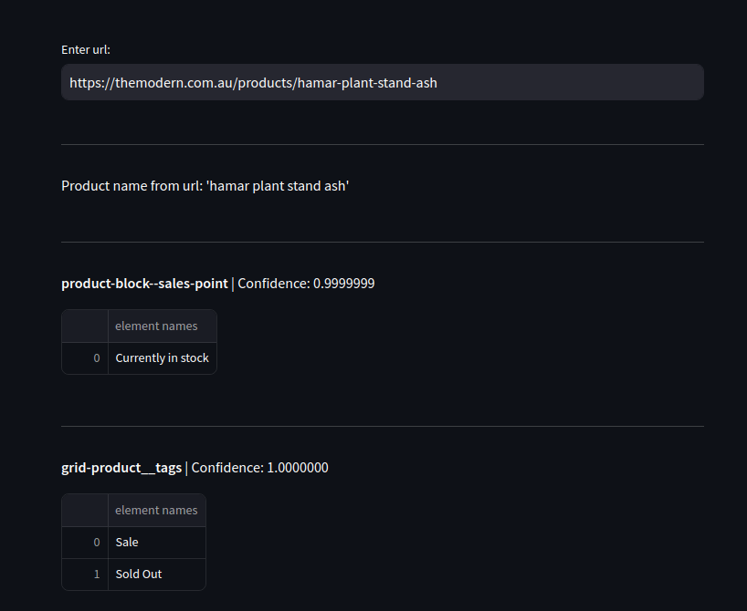
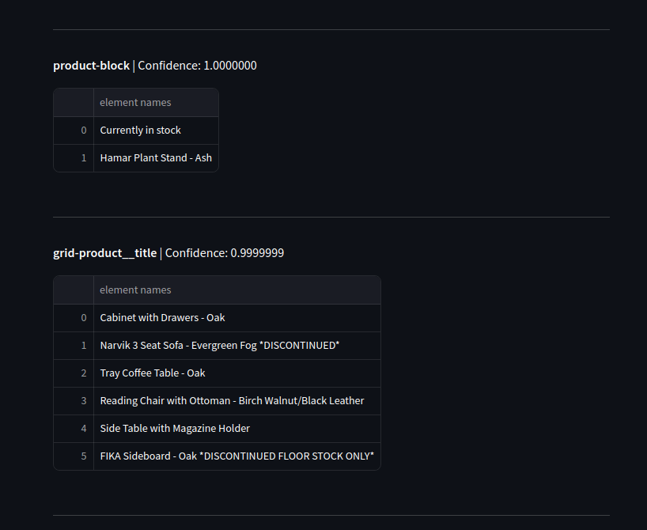

# NLP Test

## Project Structure
- `data/` — contains data.
- `models/` — contains trained models.
- `utils/` — contains utility functions.
    - [utils.py](utils/utils.py) - project utility functions.
    - [streamlit_utils.py](utils/streamlit_utils.py) - demo application utility functions.
- `scripts/` — contains scripts for data processing.
  - [extract_status_code.py](scripts/extract_status_code.py) — script for checking the status of links.
  - [collect_dataset.py](scripts/collect_dataset.py) — script for collecting element classes that contain product names.
  - [train_ner.py](scripts/train_ner.py) — script for training the NER model.
- `notebooks/` — contains a Jupyter Notebook.
  - [urls_preview.ipynb](notebooks/urls_preview.ipynb) — Notebook with a preview of URLs and the dataset.

## Description

The idea of the project is to use the NER model to identify HTML element classes that contain product names on a page.

As a baseline, an algorithmic approach can be used since some URLs already contain product names that can help find the corresponding element class. Additionally, some classes have descriptive names, such as `product-title`, `product__name`, etc.

Using the baseline, I also compile a dataset for training the NER model.

### Implementation

1. **Link Checking:**
   - The initial dataset contains 704 links. I check their functionality:
     - Only 280 links returned a status of 200.

2. **Extracting Product Names:**
   - Algorithmically, it is possible to extract the product name from the URL.
   - From 280 links, 173 product names were successfully extracted.

3. **Determining Element Classes:**
   - By the product name, HTML elements that contain product information can be found.
   - For example, the main product on [this site](https://themodern.com.au/products/hamar-plant-stand-ash) uses the class `product-single__title`, while recommended products use `grid-product__title`.
   - A total of 170 element class names containing the product name were algorithmically collected.

4. **NER Model:**
   - A NER model is used to determine whether the text of an element is the product name based on its class.

## Installation and Launch Demo

To run the demo application, please follow these steps:

### Clone the Repository
```bash
git clone https://github.com/Tikhon-Radkevich/NLP-test.git
cd nlp_test
```

### Set Up the Virtual Environment
```bash
python -m venv .venv
source .venv/bin/activate
```

### Install Dependencies
```bash
pip install -r requirements.txt
```

### Run the Demo
```bash
streamlit run ./demo_app.py
```

## Example
Store URL was used as an example:
```bash
https://themodern.com.au/products/hamar-plant-stand-ash
```




## Conclusion
The model performs well in identifying elements with product names, both for the main product and the recommended ones. However, in some elements, the product name is duplicated. Additionally, there are elements that do not contain a product name at all.


## TODO
- Improve the model by adding more data to the dataset, performing validation to select the optimal number of epochs, and tuning hyperparameters.
- Add another NER model to determine whether the text is indeed a product name.
- Improve the algorithms for extracting product names and element classes. Filter out product name duplicates.


